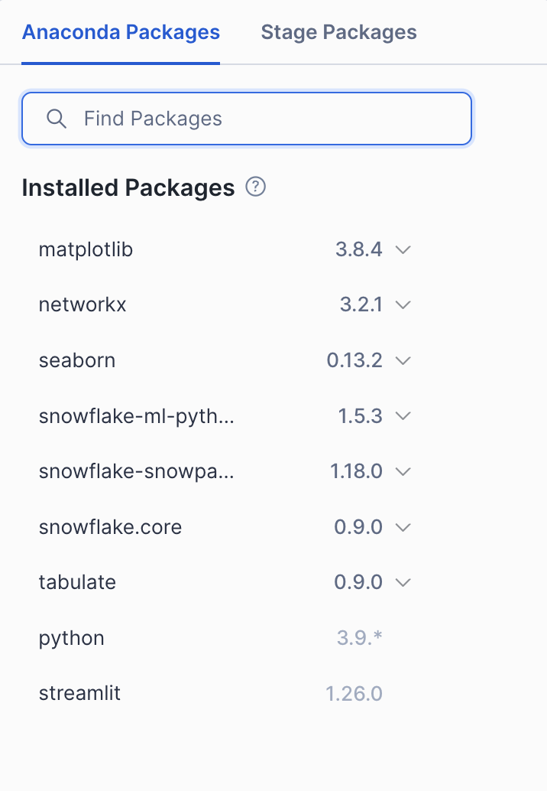

# Machine Learning in Snowflake
This repo contains a very simple example for a classical machine learning problem.  
Given some customer data from a fictional Ecommerce Company, we want to predict the yearly spent amount.

## What you'll do
In this example, you'll perform the following steps:
1. Import required Libraries
2. Create or Retrieve a Snowflake Session
3. Setup your Snowflake environment (Database, Schema, Warehouse)
4. Create an articial E-Commerce dataset 
5. Feature Engineering (Variable Imputation & Encoding)
6. Distributed Hyperparameter Tuning for an XGBoost Regression Model
7. Evaluate your trained Model
8. Register your Model in Snowflake's Model Registry
9. Automate the full pipeline with Snowflake's Python API
10. Clean Up

## Requirements
* Snowflake Account
* Access to Snowflake Notebooks (optional, currently in PrPr)

# How to run this example with your local IDE
If you prefer to run this example with your local environment, please make sure to create a fresh environment with the provided ```conda_env.yml```.  
This will ensure that you have all the required dependencies.

To create a fresh environment, simply run this command and then select ```simple-ml-demo``` as your working environment in your IDE:
```bash
conda env create -f conda_env.yml
```

Execute the ```demo_notebook.ipynb``` using your freshly created environment.

# How to run this example in Snowflake Notebooks
1. On the right side under ```Projects``` you click ```Notebooks```.
2. On the top right, you click ```Import .ipynb File```.
3. Select the ```demo_notebook.ipynb```
4. Add the required packages at the top right and specify the correct versions as shown in this image:  

